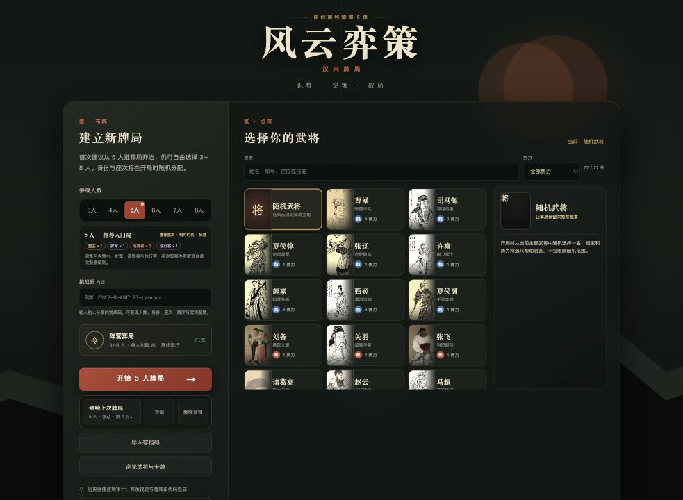
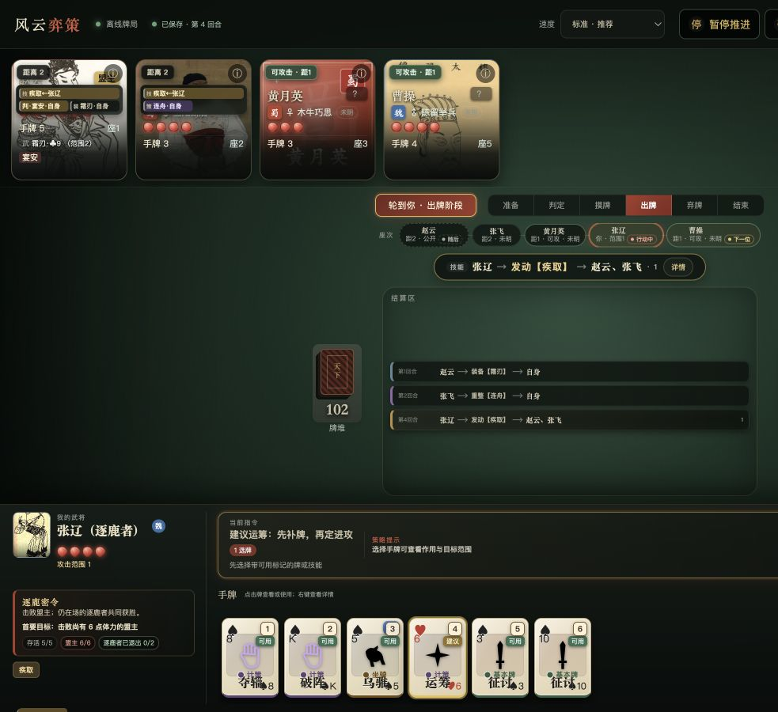

# 风云弈策 · 汉末牌局

一款汉末题材的隐藏身份策略卡牌游戏。你将与电脑角色同桌，在不断变化的阵营关系中识别敌友、使用卡牌与武将技能，并完成自己的身份目标。

## 开始游玩

1. 打开 `index.html`。
2. 选择 3–8 人牌局。
3. 选择一名武将，也可以保留“随机武将”。
4. 点击“开始牌局”。

游戏不需要安装，也可以在没有网络时游玩。第一次体验建议选择推荐的 5 人牌局。

## 身份目标

| 身份 | 你的目标 |
| --- | --- |
| 盟主 | 击败所有逐鹿者和独行客 |
| 护军 | 保护盟主并击败其敌人 |
| 逐鹿者 | 击败盟主 |
| 独行客 | 成为最后存活的角色 |

盟主的身份始终公开，其他角色的身份需要从攻击、救援和技能选择中逐步判断。自己的身份目标和当前进度会持续显示在牌桌左下方。

## 回合怎么玩

轮到你行动时：

1. 点击带有“可用”标记的手牌或技能。
2. 按提示选择目标；绿色标记表示当前可以选择。
3. 检查行动者、卡牌、目标和效果预览。
4. 点击确认执行。
5. 没有其他行动时，点击“结束出牌”。

需要响应攻击、救援角色或选择卡牌时，牌桌会暂停推进并显示对应提示。

## 读懂牌桌

- **座次与距离**：中央座次条会显示你与每名角色的距离、攻击范围和行动顺序。
- **最近事件**：中央事件区会明确显示谁对谁使用了什么卡牌或技能。
- **角色互动**：每名角色头顶保留最近五次互动，点击即可查看详情。
- **身份倾向**：角色的公开行动会形成“偏护盟”“偏逐鹿”或“未明”等线索，但不会直接揭示身份。
- **个人目标**：左下方会显示你的身份、胜利条件和公开局势进度。

点击角色、距离标记、卡牌或事件条，可以查看更完整的说明。

## 速度与辅助功能

顶部工具栏提供慢速、标准、快速和极速四档速度。你也可以暂停自动推进、跳过当前演出、打开玩法引导、查看图鉴或查阅完整战报。

手牌可使用数字键快速选择。游戏同时支持触屏操作、键盘导航、较大文字、高对比度和减少动态效果。

## 存档与分享

- **自动存档**：关闭页面后，再次打开可以继续上次牌局。
- **个人存档码**：用于在其他设备继续未完成的牌局。存档码包含隐藏信息，不要公开分享。
- **挑战码**：用于邀请其他玩家体验相同人数、身份、座次、武将和牌序的开局。

如果准备清除浏览器数据或更换设备，请先导出个人存档码。
